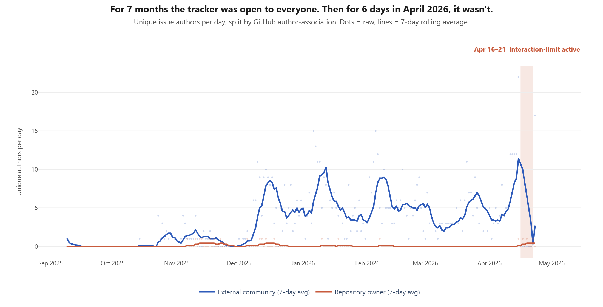
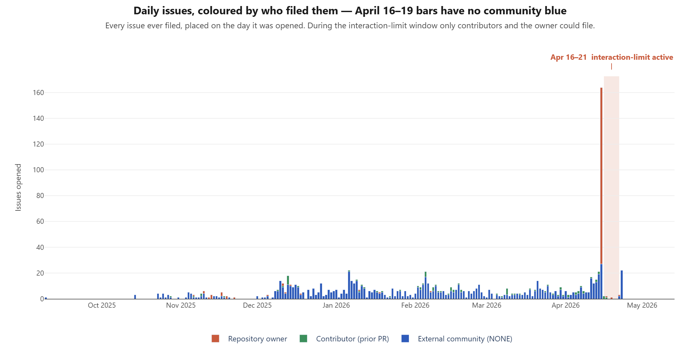
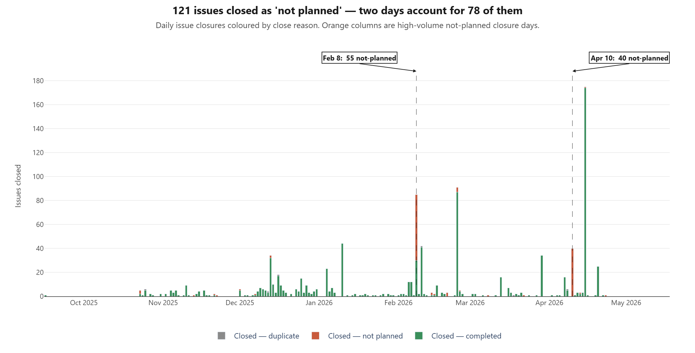
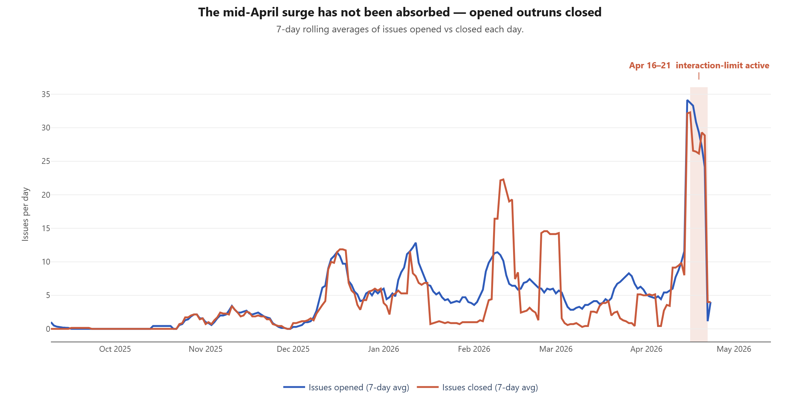

# Software quality and issue-tracker governance

Backs [`../../REPORT.md`](../../REPORT.md) §9.

This is the evidence dir for concerns about the **quality of the software as shipped** and **the way the project's issue tracker is being managed**. It is intentionally separate from the architecture findings (binary, HTTP API, scope) because those are about what the code does; this is about how it's maintained and how users' reports are handled.

I'm presenting observations, not accusations. The patterns below are unusual; how to interpret them is up to the reader.

## What's here

| file | what it is |
|---|---|
| [`issues-graphql.jsonl.gz`](issues-graphql.jsonl.gz) | All 1,114 issues ever opened on `thedotmack/claude-mem`, with metadata: number, title, state, stateReason, locked, createdAt, closedAt, comments, labels, author, authorAssociation. Captured 2026-04-24 via `../../scripts/fetch_issues.py`. 69 KB gzipped. |
| [`issues-per-day.csv`](issues-per-day.csv) | Per-day rollup: opened, opened-external/owner/contributor, unique-external-authors, closed-completed, closed-not-planned, closed-duplicate, closed-reopened. Generated by `../../scripts/analyze_issues.py`. |
| [`issue-snapshot-2026-04-23.md`](issue-snapshot-2026-04-23.md) | Five concrete bug reports filed on a single day (2026-04-23), illustrating the current state of the product. All filed the day after the interaction-limit was lifted. |
| [`interaction-limit-apr-2026.md`](interaction-limit-apr-2026.md) | Dedicated writeup of the confirmed 2026-04-16 → 2026-04-21 contributor-only interaction-limit event, with Reddit-comment evidence. |
| [`daily-external-authors.png`](daily-external-authors.png) | Line chart: unique external reporters per day (7-day rolling). Confirmed Apr 16-21 interaction-limit window is shaded. |
| [`daily-author-mix.png`](daily-author-mix.png) | Stacked bar: daily issues opened by author association (OWNER / CONTRIBUTOR / NONE). |
| [`daily-closure-mix.png`](daily-closure-mix.png) | Stacked bar: daily closures by reason (completed / not-planned / duplicate). |
| [`daily-issue-volume.png`](daily-issue-volume.png) | Line chart: issues opened vs issues closed per day (7-day rolling). |

## Reproducibility

```bash
cd scripts
python fetch_issues.py                          # defaults to thedotmack/claude-mem
python analyze_issues.py --mass-close-threshold 20
```

Both scripts work against any public GitHub repo — just pass `--owner` and `--repo`.

## Headline numbers (1,114 issues total, captured 2026-04-24)

| metric | value |
|---|---|
| Total issues opened | 1,114 |
| Currently open (including reopened) | 140 |
| Closed — completed | 847 (76.0%) |
| Closed — not planned | 121 (10.9%) |
| Closed — duplicate | 6 (0.5%) |
| Locked | 104 (9.3%) |
| Labelled `bug` | 308 (27.6%) |
| Labelled `consolidated` | 137 (12.3%) |
| Labelled `severity:high` or `severity:critical` | 68 |

## 1. Five open bug reports filed on one day

On **2026-04-23**, five separate community members (`author_association: NONE` — not contributors or collaborators) filed independent bug reports against v12.1.2 through v12.3.9. All still open at review time. Titles:

| # | author | title |
|---|---|---|
| [#2104](https://github.com/thedotmack/claude-mem/issues/2104) | marcelopossa | Observer agent's own system prompt and tool event XML are persisted as rows in `user_prompts` table (v12.1.2 – v12.3.9) |
| [#2106](https://github.com/thedotmack/claude-mem/issues/2106) | ogrotten | Multiple errors and issues encountered during install, uninstall, reinstall |
| [#2107](https://github.com/thedotmack/claude-mem/issues/2107) | songjianping-cloud | `worker-cli.js` start/restart can self-trigger duplicate-worker detection and leave claude-mem in a broken reconnect state |
| [#2108](https://github.com/thedotmack/claude-mem/issues/2108) | ahmed-hassan19 | `observer-sessions` restart/compaction churn can re-enter the same flow and consume ~97% of prompt volume |
| [#2109](https://github.com/thedotmack/claude-mem/issues/2109) | vdruts | SessionStart context injection silently fails on Windows + Git Bash (port + POSIX path bugs) |

See [`issue-snapshot-2026-04-23.md`](issue-snapshot-2026-04-23.md) for each one reproduced with the relevant excerpt from the body. These cover data-model pollution, install/uninstall hygiene, process lifecycle, prompt-volume waste, and platform-specific silent failures — in a single day's filings.

The repo also ships an [`ANTI-PATTERN-TODO.md`](https://github.com/thedotmack/claude-mem/blob/8ace1d9c84e5ce455356cf852c370ea625e3b1d1/ANTI-PATTERN-TODO.md) whose opening reads:

> Total: 301 issues | Fixed: 289 | Approved Overrides: 12 | Remaining: 0

The categories catalogued are precisely the patterns that produce silent failures: `GENERIC_CATCH`, `CATCH_AND_CONTINUE_CRITICAL_PATH`, `LARGE_TRY_BLOCK`, `NO_LOGGING_IN_CATCH`, `ERROR_MESSAGE_GUESSING`. Good that they were catalogued and fixed. Less reassuring that a plugin with access to every tool call in a developer's environment accumulated 301 of them in eight months.

A v12.3.9 changelog entry shipped this:

> Stop hook: fire-and-forget summarize. Eliminated the ~110s terminal block when a session ended.

A 110-second terminal hang at session end, shipped to users.

## 2. Mass-dismissal days

121 of 1,114 issues (10.9%) are closed as `NOT_PLANNED`. That rate is elevated — healthy OSS projects typically sit under 5%. The distribution is not uniform: two days account for **78 of the 121 closures** (64%):

| day | NOT_PLANNED closures |
|---|---|
| **2026-02-08** | 55 |
| **2026-04-10** | 40 |
| (all other days combined) | 26 |

Closing many issues as "not planned" on a single day is a moderation pattern worth naming. It's how maintainers mass-clear a backlog when they've decided not to act on a class of reports. Whether that's reasonable depends on what's in the closed tickets; I haven't read all 95 to judge. It's present as a pattern.

## 3. Issues closed-and-locked on the same day

"Locked" on GitHub means no further comments. 104 issues (9.3%) are locked. 62 are closed+locked — which practically means "this is finished, no more discussion from the community." Top days for closed+locked activity:

| day | closed+locked |
|---|---|
| 2025-12-13 | 10 |
| 2026-02-05 | 5 |

The 10-issue closed+lock event on 2025-12-13 is the biggest single "seal the discussion" moment in the history of the tracker.

## 4. The `convert-feature-requests-to-discussions` workflow

The repo's CI includes [`.github/workflows/convert-feature-requests.yml`](https://github.com/thedotmack/claude-mem/blob/8ace1d9c84e5ce455356cf852c370ea625e3b1d1/.github/workflows/convert-feature-requests.yml), which triggers on `issues:` events and auto-converts anything tagged as a feature request into a GitHub discussion. 105 issues carry the `feature-request` label.

Moving feature requests to discussions reduces the visible open-issue count the project shows at the top of its GitHub page. This is a legitimate workflow choice in principle; it's worth knowing it's happening because the open-issue count understates user-requested work in progress.

## 5. Owner files (and reopens) a lot of their own tickets

162 of 1,114 issues (14.5%) are filed by the owner against their own repo, which is normal for an active maintainer using the tracker as a todo list. More unusual:

- **79 of 81 currently-reopened issues (97%)** are reopened versions of **owner-authored** tickets. Only 1 reopened issue is from a community contributor.
- That means the tracker's "reopened" state is almost exclusively an author-side mechanism (re-filing to re-surface as in-progress work) rather than the community-facing "this wasn't fixed, please look again" signal it typically is.

## 6. Interaction-limit detection (daily)

Simple creation-gap detection (days with zero new issues) isn't sensitive enough because the owner files many of their own tickets programmatically, and GitHub's interaction-limit feature doesn't shut down issue creation entirely — it just blocks **external (NONE-association)** users while continuing to let **contributors, collaborators, and the owner** file. The signature is therefore *"day with any issue activity, zero external authors, at least one contributor/owner/collaborator filing."*

### 6.1 Confirmed event: 2026-04-16 → 2026-04-21

The repository had GitHub's **contributor-only interaction-limit** turned on for approximately six days in April 2026, which appears to have prevented external users from filing bug reports. Full writeup with direct Reddit evidence at [`interaction-limit-apr-2026.md`](interaction-limit-apr-2026.md); headline extract below.



The shaded region on the chart is the confirmed interaction-limit window. Per-day activity across and around it:

The first four count columns are issue counts. `unique external authors` is separate, because one person can file multiple issues in a day.

| date | total issues | external issues | contrib issues | owner issues | unique external authors | signature |
|---|---:|---:|---:|---:|---:|---|
| 2026-04-11 | 17 | 16 | 1 | 0 | 12 | normal |
| 2026-04-12 | 12 | 12 | 0 | 0 | 12 | normal |
| 2026-04-13 | 15 | 13 | 2 | 0 | 12 | normal |
| 2026-04-14 | 21 | 19 | 2 | 0 | 12 | normal |
| **2026-04-15** | **164** | **27** | **0** | **137** | **22** | surge (likely trigger) |
| **2026-04-16** | **2** | **0** | **2** | **0** | **0** | interaction-limit |
| **2026-04-17** | **2** | **0** | **1** | **1** | **0** | interaction-limit |
| 2026-04-18 | 0 | 0 | 0 | 0 | 0 | silent |
| **2026-04-19** | **1** | **0** | **0** | **1** | **0** | interaction-limit |
| 2026-04-20 | 0 | 0 | 0 | 0 | 0 | silent |
| 2026-04-21 | 0 | 0 | 0 | 0 | 0 | silent (Reddit post 14:27 UTC) |
| 2026-04-22 | 3 | 2 | 0 | 1 | 2 | first external filer |
| 2026-04-23 | 22 | **22** | 0 | 0 | **17** | pent-up flood |

**Direct evidence** from Reddit user `xii` on 2026-04-21 ([original comment](https://www.reddit.com/r/ClaudeCode/comments/1scz5kk/comment/ohe4en3/)):

> I tried submitting a bug report, but you've blocked everyone but contributors access to creating any kind of issue. […] when it was time to submit, I was once again greeted with:
>
> > *"An owner of this repository has limited the ability to create an issue to users that have contributed to this repository in the past."*

That is the verbatim GitHub error message for contributor-only interaction-limit. See [`interaction-limit-apr-2026.md`](interaction-limit-apr-2026.md) for the full Reddit comment and the baseline context (31 of 31 prior days had external filings).

The five open bug tickets in [`issue-snapshot-2026-04-23.md`](issue-snapshot-2026-04-23.md) — filed by five independent community members within 24 hours — are the first visible portion of the demand that had built up during the interaction-limit window.

### 6.2 Daily issues opened, split by author association



Stacked-bar view: one bar per calendar day showing how many issues were opened and by whom. The Apr 16–19 bars have only a green (contributor) or red (owner) segment, no blue (external) segment — the interaction-limit signature as a visual pattern.

### 6.3 Candidate earlier signature cluster (low confidence)

The same detector also flags four days in November 2025 where issue activity was present but zero external authors appeared:

| date | total | external | owner |
|---|---|---|---|
| 2025-11-12 | 1 | 0 | 1 |
| 2025-11-13 | 3 | 0 | 3 |
| 2025-11-19 | 2 | 0 | 2 |
| 2025-11-22 | 1 | 0 | 1 |

All four are low-volume (1–3 issues each), no contributors filed, only the owner was active. The repo was still pre-adoption in November 2025 with low overall volume, so "external authors = 0" on a given day could plausibly mean "no external users were filing anything that day" rather than "external users were prevented from filing." However, the clustering of four signature-matching days within a 10-day window is worth flagging as a candidate earlier event. **Candidate, not confirmed** — no external corroboration (no Reddit post, no GitHub error screenshot) for the November cluster.

### 6.4 Creation-gap runs (for completeness)

Days with zero new issues filed at all (from any author), grouped into consecutive runs of ≥3 days:

| period | days with zero new issues |
|---|---|
| 2025-09-10 .. 2025-10-13 | 34 |
| 2025-10-15 .. 2025-10-22 | 8 |
| 2025-11-23 .. 2025-11-30 | 8 |

These are all in the project's pre-adoption period and are less sensitive than the interaction-limit signature above — they'd only detect a full tracker-disable, not contributor-only mode. They are included for completeness.

## 7. Supplementary charts

### 7.1 Issue-closure mix over time



Closures per day split by reason. The tall `Not planned` (red) spikes on **2026-02-08** (55 closures) and **2026-04-10** (40 closures) are the two high-volume not-planned closure days documented in §2 — clearly visible here as single-day events distinct from the usual closure pattern.

### 7.2 Opened vs closed volume (7-day rolling)



Rolling-average view of opened-vs-closed volume. The mid-April 2026 divergence — opened rising sharply while closed flattens — is the stargazer amplification cohort converting some fraction into bug reporters, and is the first real stress-test of the project's maintenance throughput. Closure rate has not kept pace.

## 7. How to read all of this

Software quality in an OSS project is hard to judge from the outside. The indicators that tend to matter to me for "am I comfortable putting this in my dev environment" are:

1. **Rate of concrete bug reports against current versions** — five open ones filed in a single day against the latest three point-releases is a lot.
2. **How many of those reports are acknowledged vs closed as not planned** — ~11% not-planned rate with two big closure days is elevated.
3. **Whether discussion gets locked** — 62 closed-and-locked issues is present as a pattern.
4. **Whether the visible open-issue count is the whole story** — the auto-conversion workflow means the top-line number is understating.
5. **Anti-pattern volume in the maintainer's own self-review** — 301 silent-failure anti-patterns catalogued over 8 months is substantial even after fixing.

None of these individually would be disqualifying to me. Together they describe a project that is shipping fast while carrying a lot of maintenance pressure. Whether that's acceptable for a tool that lives inside your agent loop with your credentials is a judgment call.
