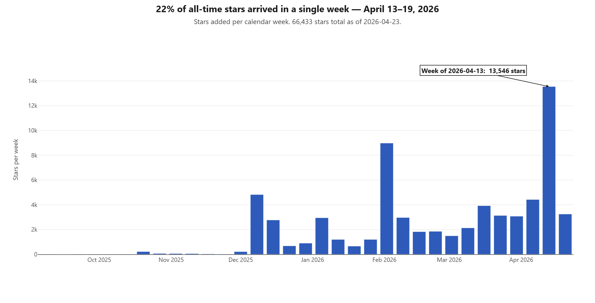
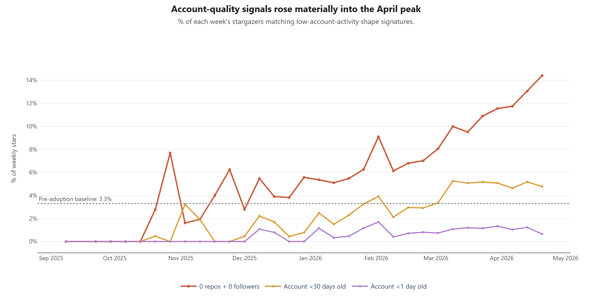

# Stargazers — full-corpus amplification analysis

Backs [`../../REPORT.md`](../../REPORT.md) §8 Priority 7 revisited.

## What's here

| file | what it is |
|---|---|
| [`stars-graphql.jsonl.gz`](stars-graphql.jsonl.gz) | All 66,433 stargazer records (≈13 MB gzipped to ≈2 MB). One JSON edge per line: `starredAt` + user metadata (login, createdAt, followers, following, repositories). Fetched via GraphQL v4 on 2026-04-24. |
| [`per-day.csv`](per-day.csv) | Per-day account-quality signal table: `day,stars,throwaway_pct,fresh_30d_pct,fresh_7d_pct,fresh_1d_pct,fresh_1h_pct,bot_pattern_pct`. 196 rows, one per day the repo has been starred. |
| [`analysis.md`](analysis.md) | Key numbers, tables, and the top-20 spike days. |
| [`april-cohort-sample.md`](april-cohort-sample.md) | A sample of the April 13 calendar-week cohort showing the repeated suffix login pattern. |
| [`weekly-star-volume.png`](weekly-star-volume.png) | Chart: stars added per calendar week across the project's life. |
| [`weekly-account-quality-signals.png`](weekly-account-quality-signals.png) | Chart: account-quality signals (throwaway %, <30d %, <1d %) per week. |

## Reproducing the dataset

```bash
cd scripts
python fetch_stars.py            # fetches via gh api graphql, ~30 min
python analyze_stars.py          # regenerates per-day.csv + key tables
```

If a long fetch is interrupted, `python fetch_stars.py` resumes from the last cursor checkpoint, and `python fetch_stars.py --resume-from-last` resumes from the last record in the data file (useful if the checkpoint is missing or stale).

## The shape of it

### When the stars arrived



One calendar week in April 2026 holds 22% of the repository's entire all-time star count. The two earlier spikes (December 8 week, February 2 week) align with known product pushes; the April 13 week dwarfs both.

### What kind of accounts starred, over time



The red "0 repos + 0 followers" line is the cleanest signal. It sits at ~3% through the project's pre-adoption period, drifts up through December–February, and accelerates through March into the April peak. The rate is not strictly increasing week by week, but the move from a 3.3% baseline to 13.1% in the peak week is not noise.

## Headline numbers

| metric | baseline (pre-2025-12, n=454) | full corpus (n=66,433) | April 13 calendar week (n=13,546) |
|---|---|---|---|
| throwaway-shape (0 repos + 0 followers) | 3.3% | 9.3% | **13.1%** |
| account <30d old at starring | 0.9% | 3.9% | 5.1% |
| account <7d old | 0% | 1.8% | 3.3% |
| account <1d old | 0% | 1.1% | 1.2% |
| account <1h old | 0% | 0.47% | **0.78%** |
| bot-pattern login | 2.9% | 5.2% | 5.9% |

## Verdict

The star graph has a measurable amplification layer, rising materially and concentrated in the last three months of repo history. The 34k → 66k jump noted during prior passes substantially overlaps with the April amplification cohort. Approximately 9,000–13,000 stars of the 66k sit on top of an organic base of ~53,000.

77% of stargazers have accounts >2 years old — the repo's core popularity is real. The amplification layer is additive, not a replacement for the organic interest.

See [`analysis.md`](analysis.md) for the weekly-cohort table showing the signal rising over time, and [`april-cohort-sample.md`](april-cohort-sample.md) for a representative slice of the April 13 calendar-week cohort with repeated suffix login patterns.
